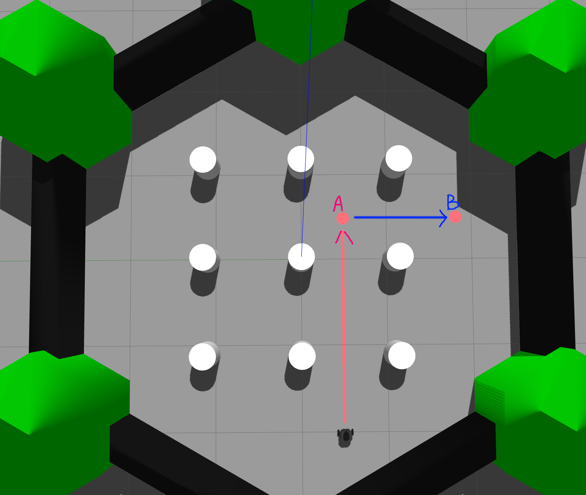

# ROS作业

## **一、作业形式**

---

请各位同学安装 turtlebot3 机器人仿真，要求在gazebo获取小车的里程计数据(odom)作为反馈，控制小车速度使其到达指定的位置。

## **二、指南**

---

**1. 安装turtlebot3仿真**

- 安装指南

```
$ mkdir -p ~/catkin_ws/src      # 个人工作空间
$ cd ~/catkin_ws/src/
$ git clone -b noetic-devel https://github.com/ROBOTIS-GIT/DynamixelSDK.git
$ git clone -b noetic-devel https://github.com/ROBOTIS-GIT/turtlebot3_msgs.git
$ git clone -b noetic-devel https://github.com/ROBOTIS-GIT/turtlebot3.git
$ git clone -b noetic-devel https://github.com/ROBOTIS-GIT/turtlebot3_simulations.git
$ cd ~/catkin_ws
$ catkin build
```

- 开启仿真

```
$ export TURTLEBOT3_MODEL=burger # 指定机器人类型,推荐写入bashrc，可避免重复输入
$ roslaunch turtlebot3_gazebo turtlebot3_world.launch
```

```jsx
$ roslaunch turtlebot3_teleop turtlebot3_teleop_key.launch
 note: 官方节点，可用键盘控制小车运动
```

**2. 接口数据**

- 列出已订阅/已发布的 rostopics 的完整列表 (`rostopic list -v`):

```
Published topics:
 * /rosout_agg [rosgraph_msgs/Log] 1 publisher
 * /rosout [rosgraph_msgs/Log] 2 publishers
 * /clock [rosgraph_msgs/Clock] 1 publisher
 * /gazebo/link_states [gazebo_msgs/LinkStates] 1 publisher
 * /gazebo/model_states [gazebo_msgs/ModelStates] 1 publisher
 * /gazebo/performance_metrics [gazebo_msgs/PerformanceMetrics] 1 publisher
 * /gazebo/parameter_descriptions [dynamic_reconfigure/ConfigDescription] 1 publisher
 * /gazebo/parameter_updates [dynamic_reconfigure/Config] 1 publisher
 * /scan [sensor_msgs/LaserScan] 1 publisher
 * /joint_states [sensor_msgs/JointState] 1 publisher
 * /tf [tf2_msgs/TFMessage] 1 publisher
 * /odom [nav_msgs/Odometry] 1 publisher
 * /imu [sensor_msgs/Imu] 1 publisher

Subscribed topics:
 * /clock [rosgraph_msgs/Clock] 3 subscribers
 * /rosout [rosgraph_msgs/Log] 1 subscriber
 * /gazebo/set_link_state [gazebo_msgs/LinkState] 1 subscriber
 * /gazebo/set_model_state [gazebo_msgs/ModelState] 1 subscriber
 * /cmd_vel [geometry_msgs/Twist] 1 subscriber
```

- **Topics 部分功能细节**

*具体细节参考google,ros wiki*

| **Name** | **Type** | **Description** |
| --- | --- | --- |
| `/odom` | `nav_msgs/Odometry` | 提供机器人的里程计信息，包括位置和速度，用于跟踪机器人在空间中的位置和方向。 |
| `/cmd_vel` | `geometry_msgs/Twist` | 接收控制命令，用于控制机器人的线速度和角速度，实现机器人运动指令的输入。 |
| `/scan` | `sensor_msgs/LaserScan` | 提供激光雷达数据，包含环境中障碍物的距离信息，用于避障和导航。 |
| `/imu` | `sensor_msgs/Imu` | 提供IMU（惯性测量单元）数据，包含加速度和角速度信息，用于姿态估计和运动状态跟踪。 |

## **三、任务**

---

### ☀️**必做**



- 控制小车速度话题`/cmd_vel`的令其朝图中直线方向运动，同时接收odom数据，当odom数据记录的里程已到达A点坐标**(x = 0.55, y = -0.49)**，改变速度方向，朝B点坐标**(x = 0.55, y = -1.64)**方向运动，当odom数据记录的里程到达B点坐标，令小车停在B点

### 🚵**评分细则**

**1. 创建新的 ros_package（5 分）**

- 🎲要求：
    
    1.**ros_package必须要有include，src，launch文件夹，**代码文件按需放置
    
    2.正确填写 **CMakeList.txt**, **package.xml**
    
- 🔑参考资料：
    
    1.[在clion使用ros](https://blog.csdn.net/qq_37416258/article/details/117082293?fromshare=blogdetail&sharetype=blogdetail&sharerId=117082293&sharerefer=PC&sharesource=weixin_62594540&sharefrom=from_link)
    
    2.[catkin/CMakeLists.txt](http://wiki.ros.org/catkin/CMakeLists.txt)
    
    3.[package.xml](http://wiki.ros.org/catkin/package.xml)
    

**2. 正确的代码规范（5 分）**

- 🥇要求：
    
    1.请用C++作为代码工具进行编程
    
    2.请注重代码规范，这有利于团队协同开发，将根据个人代码规范酌情给分
    
- 🍭参考资料：
    
    1. [ROS C++ Style Guide](http://wiki.ros.org/CppStyleGuide)
    
    2.[Google C++ Style](https://google.github.io/styleguide/cppguide.html)
    

**3. 版本管理（5 分）**

- 👽要求：
    
    请将项目上传至自己帐户代码仓库，只提交任务package，turtlebot的代码不要提交，最后我们会在群里发问卷星，提交个人仓库github链接，可按参考资料里面文件夹的规范进行创建(自行删剪)
    
- **🎒**参考资料：
    
    [rm_template](https://github.com/gdut-dynamic-x/rm_template)
    

**4. 控制小车到达A点（10 分）**

**5. 控制小车到达B点（10 分）**

**6. 用launch启动任务节点（5 分）**

- 🍰要求：请将要启动的所有节点写至一个launch文件

---

### 🌙**选做**

**7. 雷达停车（10 分）**

请做完**必做**的基础上选择完成此题

- 🤌要求：
    
    小车在到达B点时不停下，调用雷达数据 `/scan` 对小车右方的墙壁进行测距，当小车距离前方为**0.3米**时，将速度归0，停下小车。
