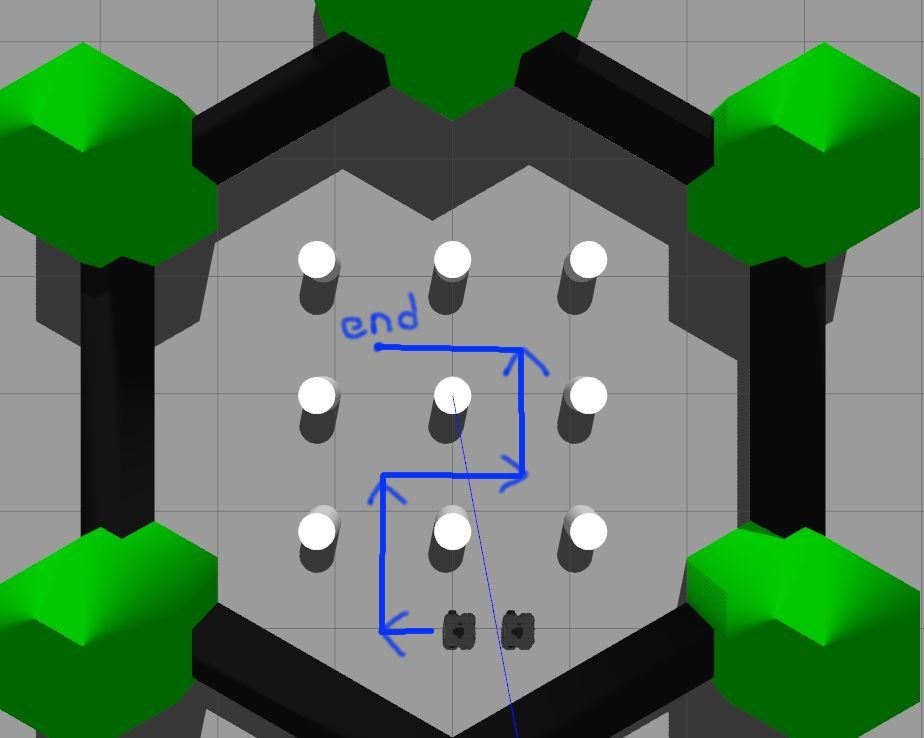
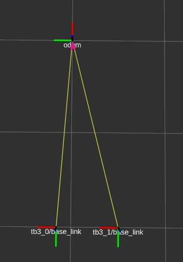

# ROS作业2

## **一、任务要求**

请各位同学创建个新的ros_package，要求启动给定的launch后，用键盘控制tb3_0(已经集成在launch里面了)按指定的轨迹运动(速度快慢自己把握)，要求tb3_1获取tf: `tb3_0/base_link-->tb3_1/base_link`，借助获取到两台车底盘坐标系的相对位姿关系，控制tb3_1跟随tb3_0的运动轨迹运动。



## **二、细则**

**1. 请创建新文件multi_turtlebot3.launch**

创建该文件后，将以下内容写入文件内，启动后可看到两个机器人tb3_0和tb3_1

```jsx
<launch>
  <arg name="model" default="$(env TURTLEBOT3_MODEL)" doc="model type [burger, waffle, waffle_pi]"/>
  <arg name="first_tb3"  default="tb3_0"/>
  <arg name="second_tb3" default="tb3_1"/>

  <arg name="first_tb3_x_pos" default="-2.0"/>
  <arg name="first_tb3_y_pos" default="-0.0"/>
  <arg name="first_tb3_z_pos" default=" 0.0"/>
  <arg name="first_tb3_yaw"   default=" 1.57"/>

  <arg name="second_tb3_x_pos" default="-2.0"/>
  <arg name="second_tb3_y_pos" default="-0.5"/>
  <arg name="second_tb3_z_pos" default=" 0.0"/>
  <arg name="second_tb3_yaw"   default=" 1.57"/>

  <include file="$(find gazebo_ros)/launch/empty_world.launch">
    <arg name="world_name" value="$(find turtlebot3_gazebo)/worlds/turtlebot3_world.world"/>
    <arg name="paused" value="false"/>
    <arg name="use_sim_time" value="true"/>
    <arg name="gui" value="true"/>
    <arg name="headless" value="false"/>
    <arg name="debug" value="false"/>
  </include>  

  <group ns = "$(arg first_tb3)">
    <include file="$(find turtlebot3_teleop)/launch/turtlebot3_teleop_key.launch"/>
    <param name="robot_description" command="$(find xacro)/xacro --inorder $(find turtlebot3_description)/urdf/turtlebot3_$(arg model).urdf.xacro" />

    <node pkg="robot_state_publisher" type="robot_state_publisher" name="robot_state_publisher" output="screen">
      <param name="publish_frequency" type="double" value="50.0" />
      <param name="tf_prefix" value="$(arg first_tb3)" />
    </node>
    
    <node name="spawn_urdf" pkg="gazebo_ros" type="spawn_model" args="-urdf -model $(arg first_tb3) -x $(arg first_tb3_x_pos) -y $(arg first_tb3_y_pos) -z $(arg first_tb3_z_pos) -Y $(arg first_tb3_yaw) -param robot_description" />
  </group>

  <group ns = "$(arg second_tb3)">
    <param name="robot_description" command="$(find xacro)/xacro --inorder $(find turtlebot3_description)/urdf/turtlebot3_$(arg model).urdf.xacro" />

    <node pkg="robot_state_publisher" type="robot_state_publisher" name="robot_state_publisher" output="screen">
      <param name="publish_frequency" type="double" value="50.0" />
      <param name="tf_prefix" value="$(arg second_tb3)" />
    </node>

    <node name="spawn_urdf" pkg="gazebo_ros" type="spawn_model" args="-urdf -model $(arg second_tb3) -x $(arg second_tb3_x_pos) -y $(arg second_tb3_y_pos) -z $(arg second_tb3_z_pos) -Y $(arg second_tb3_yaw) -param robot_description" />
  </group>

</launch>
```

**2. 两小车间需保持1.0m的[曼哈顿距离](https://en.wikipedia.org/wiki/Taxicab_geometry)，这个距离长度可以通过参数服务器指定**

**3. 可借助rviz或rqt看tf关系**



**4. 一定要注重代码规范，参考上节课作业要求的[ROS C++ Style Guide](http://wiki.ros.org/CppStyleGuide), 否则将酌情扣分！！！**

## **三、考核方式**

- 到时候直接带电脑来现场验收(看演示效果+提问)，也记得push到github，有良好的版本管理(明确的commit)会有加分
